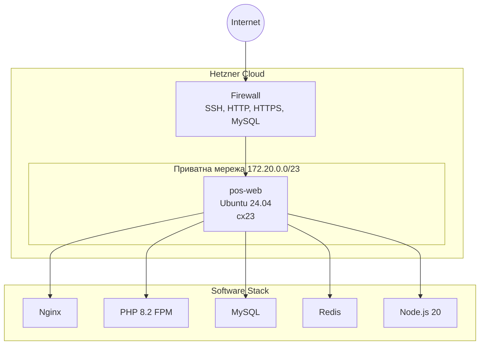

# PosSystem Infrastructure

Інфраструктурний репозиторій для розгортання проектів на Hetzner Cloud.

## 📁 Структура проекту

```
possystem-infra/
├── ansible-playbooks/        # Ansible конфігурації для провізіонування серверів
│   ├── inventory/            # Інвентарі хостів для різних середовищ
│   │   └── production/       # Продакшн середовище
│   │       ├── group_vars/   # Змінні групи хостів
│   │       │   └── all.yml   # Глобальні змінні для всіх хостів
│   │       └── web           # Інвентар веб-серверів (IP, SSH ключ)
│   ├── roles/                # Ansible ролі для різних сервісів
│   │   ├── common/           # Базові пакети та налаштування користувачів
│   │   ├── deploy/           # Підготовка директорій для деплою
│   │   ├── mysql/            # Встановлення та конфігурація MySQL
│   │   ├── nginx/            # Встановлення та конфігурація Nginx
│   │   ├── nodejs/           # Встановлення Node.js через NodeSource
│   │   ├── php/              # PHP 8.2 FPM з розширеннями + Composer
│   │   ├── redis/            # Встановлення та конфігурація Redis
│   │   └── security/         # Fail2Ban + конфігурація SSH
│   ├── hetzner_key           # Приватний SSH ключ для підключення
│   └── web.yml               # Головний playbook для веб-серверів
│
└── terraform/                # Terraform конфігурації для IaC
    ├── hetzner/              # Конкретні середовища Hetzner
    │   ├── network/          # Мережева інфраструктура
    │   │   ├── network.tf    # Виклик модуля мережі
    │   │   ├── variables.tf  # Декларація вхідних змінних
    │   │   ├── terraform.tfvars  # Значення змінних (IP діапазони)
    │   │   ├── terraform.tf  # Конфігурація провайдера
    │   │   └── outputs.tf    # Експорт network_id
    │   └── web/              # Веб-сервери
    │       ├── web.tf        # SSH ключ + виклик модуля web-and-lb
    │       ├── variables.tf  # Декларація змінних серверів
    │       ├── terraform.tfvars  # Конфігурація серверів та firewall
    │       ├── remote_state.tf   # Читання network_id з remote state
    │       ├── terraform.tf  # Конфігурація провайдера
    │       ├── outputs.tf    # Виводи (IP адреси тощо)
    │       └── files/        # SSH публічні ключі
    ├── modules/              # Перевикористовувані Terraform модулі
    │   └── hetzner/
    │       ├── network/      # Модуль мережі Hetzner
    │       │   ├── network.tf    # Ресурси hcloud_network та subnet
    │       │   ├── variables.tf  # Вхідні змінні модуля
    │       │   ├── outputs.tf    # Експорт network_id
    │       │   ├── versions.tf   # Версії провайдерів
    │       │   └── README.md     # Документація модуля (tf-docs)
    │       └── web-and-lb/   # Модуль веб-серверів та Load Balancer
    │           ├── web.tf        # Firewall, сервери, volumes, placement groups
    │           ├── lb.tf         # Load Balancer + сервіси
    │           ├── variables.tf  # Вхідні змінні модуля
    │           ├── outputs.tf    # Виводи модуля
    │           ├── versions.tf   # Версії провайдерів
    │           └── README.md     # Документація модуля (tf-docs)
    └── hetzner_key           # Приватний SSH ключ
```

---

## 📋 Опис компонентів

### Ansible Playbooks

#### Головний Playbook

| Файл | Опис |
|------|------|
| `web.yml` | Головний playbook для провізіонування веб-серверів. Виконує оновлення apt та запускає ролі в потрібному порядку. |

#### Inventory (Production)

| Файл | Опис |
|------|------|
| `inventory/production/web` | Список веб-серверів з їх IP-адресами та параметрами SSH підключення |
| `inventory/production/group_vars/all.yml` | Глобальні змінні: паролі MySQL, список сайтів, версія PHP, SSH порт |

#### Ролі

| Роль | Призначення |
|------|-------------|
| `common` | Встановлює базові пакети (git, curl, zip, htop, vim). Створює deploy-користувача з passwordless sudo. |
| `security` | Встановлює Fail2Ban. Конфігурує SSH: root login тільки по ключу, відключення паролів. |
| `mysql` | Встановлює MySQL сервер. Встановлює root пароль, створює БД та користувача додатку. |
| `redis` | Встановлює Redis та конфігурує для роботи з systemd. |
| `php` | Встановлює PHP 8.2 FPM з розширеннями (mysql, curl, gd, mbstring, xml, zip, bcmath, intl). Встановлює Composer. |
| `nodejs` | Встановлює Node.js 20.x LTS через NodeSource (включає npm). |
| `nginx` | Встановлює Nginx. Створює vhost конфігурації для сайтів з `group_vars`. |
| `deploy` | Налаштовує директорії для деплою (з `sites` змінних). |

---

### Terraform

#### Середовище `hetzner/network`

| Файл | Опис |
|------|------|
| `network.tf` | Виклик модуля `modules/hetzner/network` для створення приватної мережі |
| `variables.tf` | Декларація змінних: назва мережі, IP діапазони, зона |
| `terraform.tfvars` | Значення: `first-network`, `172.20.0.0/23`, `eu-central` |
| `outputs.tf` | Експорт `network_id` для використання в інших конфігураціях |

#### Середовище `hetzner/web`

| Файл | Опис |
|------|------|
| `web.tf` | Створює SSH ключ та викликає модуль `web-and-lb` для серверів |
| `variables.tf` | Декларація змінних серверів, firewall правил |
| `terraform.tfvars` | Конфігурація: сервер `pos-web` (ubuntu-24.04, cx23), правила firewall (22, 80, 443, 3600) |
| `remote_state.tf` | Читання `network_id` з remote state мережевої конфігурації |
| `files/` | Публічні SSH ключі для серверів |

#### Модуль `modules/hetzner/network`

| Файл | Опис |
|------|------|
| `network.tf` | Ресурси `hcloud_network` та `hcloud_network_subnet` для приватної мережі та підмереж |
| `variables.tf` | Вхідні змінні: назва, IP діапазони, зона, vSwitch налаштування |
| `outputs.tf` | Експорт ID мережі |

#### Модуль `modules/hetzner/web-and-lb`

| Файл | Опис |
|------|------|
| `web.tf` | Firewall, сервери (`hcloud_server`), volumes (`hcloud_volume`), placement groups |
| `lb.tf` | Load Balancer, його сервіси, мережеві підключення, targets |
| `variables.tf` | Вхідні змінні: сервери, firewall правила, LB налаштування, сертифікати |
| `outputs.tf` | Виводи модуля (IP адреси серверів) |

---

## 🛠️ Використання

### Terraform - створення інфраструктури

```bash
# 1. Спочатку мережа
cd terraform/hetzner/network
terraform init
terraform plan
terraform apply

# 2. Потім веб-сервери
cd ../web
terraform init
terraform plan
terraform apply
```

### Ansible - провізіонування серверів

```bash
cd ansible-playbooks

# Запуск всіх ролей
ansible-playbook -i inventory/production/web web.yml

# Запуск конкретної ролі
ansible-playbook -i inventory/production/web web.yml --tags nginx
```

---

## 🔐 Безпека

> [!CAUTION]
> Файли `terraform.tfvars` та `group_vars/all.yml` містять чутливі дані (паролі, API токени). Переконайтеся, що вони:
> - Додані до `.gitignore`
> - Або зашифровані через Ansible Vault / SOPS

---

## 📊 Діаграма інфраструктури



## 🌐 Сайти

| Сайт | Домен | Директорія |
|------|-------|------------|
| pos_system | sale-system.shop | /var/www/PosSystem |
| brickcraft | brickcraft.com.ua | /var/www/lego_temp |
